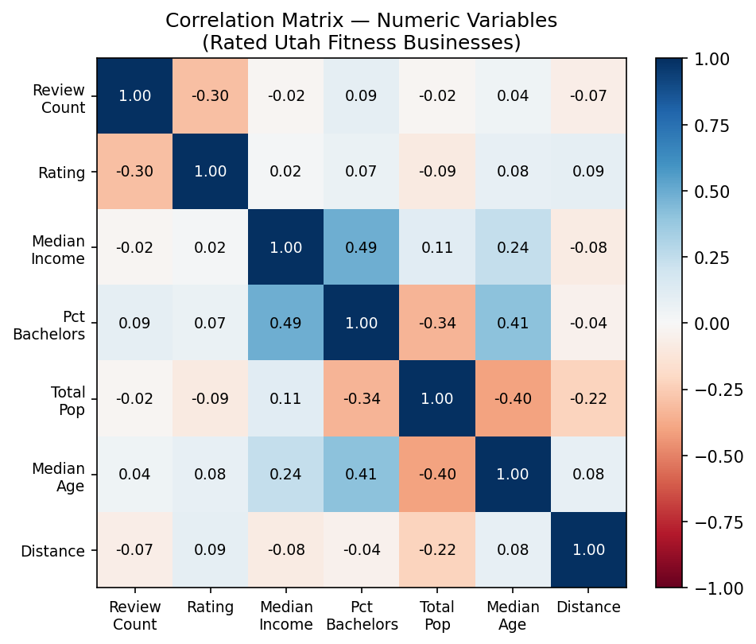
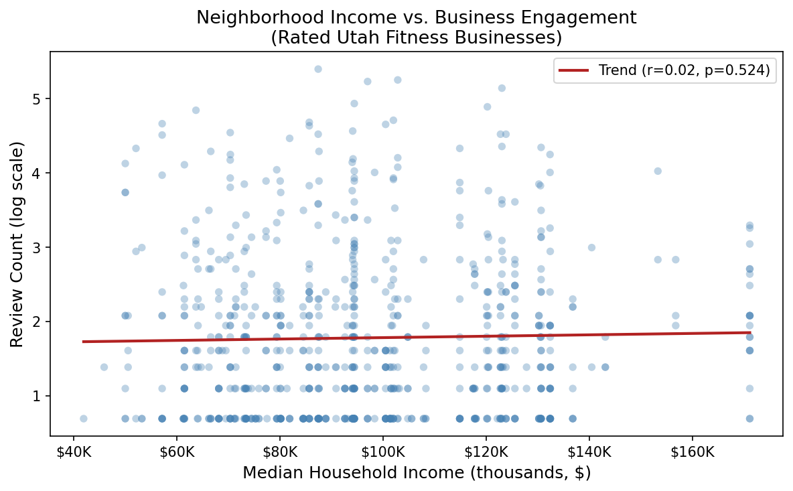
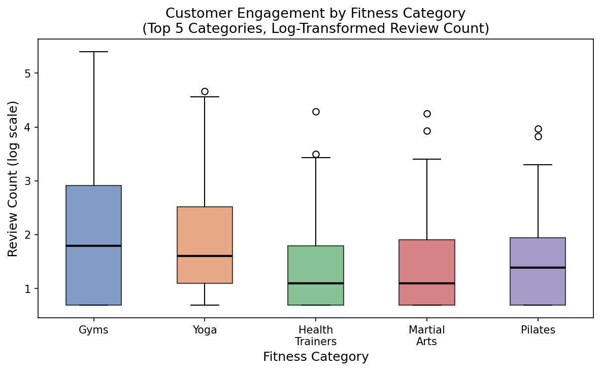

# Deliverable 2: Research Question and Exploratory Data Analysis (EDA)

## 1) Research Question and Dataset Overview

### Main Research Question
> **How do neighborhood socio-economic factors (income and education) and gym specialization (categories like Yoga vs. Martial Arts) influence the popularity and consumer engagement of fitness businesses in Utah?**

### Dataset Summary
This project integrates two primary data sources to analyze the Utah fitness market:
1.  **Demographic Data (U.S. Census Bureau):** ZCTA-level data providing median household income, educational attainment, and population counts for Utah.
2.  **Business Data (Yelp Fusion API):** Detailed business metrics for five specific fitness categories: **Gyms, Yoga, Pilates, Health Trainers, and Martial Arts**. This includes location coordinates, star ratings, and review counts.

### Data Citations
* **U.S. Census Bureau.** (2024). *American Community Survey 5-year estimates (2018-2022)*. Accessed via the `census` Python library.
* **Yelp Inc.** (2026). *Yelp Fusion API Business Search*. Retrieved from [https://www.yelp.com/developers](https://www.yelp.com/developers).

### Legal and Ethical Considerations
* **Terms of Use:** All data was retrieved through official API channels adhering to rate limits and attribution requirements. 
* **PII & Ethics:** The dataset contains no personally identifiable information (PII). All business data is public commercial information. No ethical concerns were identified as the analysis focuses on aggregate market trends rather than individual user behavior.

---

## 2) Data Description and Variables

### Key Variables
The dataset consists of features across two primary domains: Business Performance (Yelp) and Neighborhood Demographics (U.S. Census).

| Variable | Source | Type | Description |
| :--- | :--- | :--- | :--- |
| **`review_count`** | Yelp | Numeric | **Target Variable (log-transformed):** Total number of reviews; used as a proxy for customer volume and engagement. |
| **`rating`** | Yelp | Numeric | **Predictor:** The average star rating (1.0–5.0) reflecting customer satisfaction. |
| **`category`** | Yelp | Categorical | The specific fitness niche (e.g., `yoga`, `gyms`, `martialarts`). |
| **`median_income`** | Census | Numeric | Median household income of the zip code where the business is located. |
| **`pct_bachelors`** | Census | Numeric | Calculated percentage of the population with a Bachelor's degree or higher. |
| **`total_pop`** | Census | Numeric | Total population of the ZCTA (Zip Code Tabulation Area). |
| **`median_age`** | Census | Numeric | The median age of residents in the neighborhood. |
| **`distance`** | Yelp | Numeric | The distance (in meters) from the center of the search area. |
| **`latitude` / `longitude`** | Yelp | Numeric | Geographic coordinates used for mapping and spatial density analysis. |

### Target Variable
The primary target variable for this analysis is **`review_count`** (log-transformed).

* **Rationale:** The research question asks about *popularity and consumer engagement* — review count is a direct proxy for customer volume and market reach, making it the most appropriate target. `rating` is retained as a predictor variable; its negative correlation with review count (r = −0.30) suggests that engagement and satisfaction are related but distinct dimensions worth modeling separately.
* **Analytical Goal:** We are investigating whether neighborhood socio-economic factors and fitness category predict how much customer engagement a business attracts. A log transformation (`log1p`) is applied to `review_count` to address its severe right skew before modeling.

### Preprocessing Documentation
To prepare the data for a regression on `review_count`, the following steps were completed:

1.  **Deduplication:** A strict deduplication process was performed using a composite key of `name`, `latitude`, and `longitude`. This prevents franchise locations that appear in multiple adjacent zip code searches from biasing the satisfaction metrics.
2.  **Feature Engineering (`pct_bachelors`):** Created a normalized education metric by dividing `bachelors_degrees` by the `total_pop`. This allows the model to test if educational attainment in a neighborhood correlates with the types of highly-rated gyms that open there.
3.  **Handling Missing Values:**
    * **Unrated Businesses Removed:** Any businesses with a `rating` of 0 or null were removed. These businesses also had zero reviews, so their exclusion is consistent across both the target and predictor variables, and ensures the model is trained on businesses with verified consumer activity.
    * **Price:** The `price` variable was dropped as it was unavailable for over 90% of the Utah fitness sample.
4.  **Category Extraction:** Extracted the primary `alias` from Yelp’s nested category list (e.g., `yoga`, `martialarts`) to allow for categorical encoding.
5.  **Weighting Consideration:** During EDA, we noted that `rating` is influenced by sample size — a 5.0 rating with 2 reviews is less reliable than a 4.5 rating with 200 reviews. Since `rating` is now a predictor rather than the target, we may weight its influence or engineer a confidence-adjusted version in future modeling.
---

## 3) Summary Statistics

### Numeric Variables

* **Sample Size:** N = 868 (businesses with a verified rating; unrated businesses excluded)

* **Target Variable (`review_count`):**
  Mean = 10.80, SD = 21.87, Median = 3, Max = 220.
  The distribution is **highly right-skewed** — most businesses have fewer than 10 reviews while a small number drive the upper tail. A `log1p` transformation is applied before modeling to normalize the distribution.

* **Rating (predictor):**
  Mean = 4.25, SD = 1.09, Median = 5.0. Ratings cluster heavily near the top of the scale, with very little spread below 3.0. This ceiling effect makes it unsuitable as a regression target but informative as a predictor.

* **Median Income:**
  Mean = $96,539 (SD = $25,525), ranging from $41,964 to $171,151, indicating substantial socioeconomic variation across zip codes.

* **Population (`total_pop`):**
  Mean = 35,729 (SD = 16,471), showing variation in the size of communities where businesses are located.

* **Education (`pct_bachelors`):**
  Mean = 16.92% (SD = 5.44%), with values ranging from about 2% to 30%, reflecting variation in educational attainment.

---

### Categorical Variables

* **Sample Size (rated businesses only):** N = 868

* **Category Frequency Distribution:**
  The dataset contains 87 unique business categories across all observations, but the distribution is heavily concentrated in the five primary search categories. Among rated businesses:

  | Category | Count |
  | :--- | ---: |
  | Gyms | 239 |
  | Yoga | 123 |
  | Health Trainers | 100 |
  | Martial Arts | 66 |
  | Pilates | 57 |
  | Karate | 33 |
  | Interval Training Gyms | 31 |
  | Brazilian Jiu-Jitsu | 20 |
  | Bootcamps | 18 |
  | Massage Therapy | 17 |
  | Boxing | 16 |
  | Taekwondo | 14 |
  | Self Defense Classes | 10 |
  | All other categories (≤8 each) | 74 |

  The top 5 categories account for ~68% of rated businesses. The long tail of low-frequency categories (many appearing only once or twice) reflects the breadth of Yelp's taxonomy and will likely require grouping or a catch-all "other" label before modeling.

---

### Correlation Matrix

The most notable relationships among numeric variables are:

* **`review_count` and `rating` (r = −0.30):** The strongest pairwise correlation. Businesses with more reviews tend to have slightly lower average ratings — likely a regression-to-the-mean effect as sample sizes grow.
* **`median_income` and `pct_bachelors` (r = 0.49):** A moderate positive correlation, expected since higher-income neighborhoods tend to have higher educational attainment. These two variables may exhibit multicollinearity and should be monitored during modeling.
* **`pct_bachelors` and `total_pop` (r = −0.34):** More populated zip codes tend to have lower bachelor's degree rates, possibly reflecting denser, more working-class urban areas.
* **Demographic variables and the target (`review_count`):** All correlations are near zero (|r| < 0.10), confirming that neighborhood demographics alone are weak predictors of engagement.

---

### Interpretation

The summary statistics reveal several important patterns:

* The **extreme right skew** and high variance in `review_count` indicate that business popularity is highly uneven — a log transformation will be applied before modeling.
* A large number of businesses have **zero reviews and zero ratings**, which may reflect newly established businesses or missing Yelp engagement data; these were excluded from the rated subset (N = 868).
* Socioeconomic variables such as income and education show **substantial variation**, supporting their inclusion as predictors, but their near-zero correlations with engagement suggest they play a limited direct role.
* The categorical variable is **high-dimensional and sparse**, which may require grouping low-frequency categories before modeling.

## 4) Visual Exploration

### Visualization 1: Popularity vs. Neighborhood Wealth

* **What it shows:** A scatter plot of median household income (by zip code) against log-transformed review count, with a linear trend line (r = 0.02, p = 0.524).
* **Relevance:** The near-zero correlation and non-significant p-value indicate that neighborhood income does **not** meaningfully predict customer engagement for Utah fitness businesses. This is a notable finding — it suggests that business popularity is driven by factors other than neighborhood wealth (e.g., category, accessibility, or brand), and challenges the assumption that higher-income areas produce more active fitness consumers.

### Visualization 2: Engagement Levels by Fitness Category

* **What it shows:** Boxplots of log-transformed review counts across the five primary fitness categories (Gyms, Yoga, Health Trainers, Martial Arts, Pilates).
* **Relevance:** Gyms show noticeably higher median engagement and a wider spread than the other categories, suggesting they attract broader public audiences. Yoga ranks second, while Health Trainers and Pilates tend to have lower and more concentrated review counts — consistent with them serving smaller, more specialized clientele. This supports including `category` as a key predictor in the model.

---

## 5) Challenges and Reflection

### Challenges Faced
A significant challenge was the discovery that **business closure data (`is_closed`) and price data were essentially non-existent** in the current Yelp API pull for Utah. Initially, I intended to predict business failure, but the lack of "closed" gyms in the search results made this unfeasible. 

### Target Variable Selection
A key challenge was deciding between **`rating`** and **`review_count`** as the target variable. Initially, `rating` seemed appealing as a measure of service quality — a higher rating could signal business success. However, after exploring the data, we found that ratings among Utah fitness businesses are heavily clustered near 5.0 (median = 5.0), leaving very little variation to model. A regression on `rating` would have struggled to find meaningful signal.

We shifted to **`review_count`** as the target, which better aligns with the research question's focus on *popularity and consumer engagement*. It also has substantially more variation across businesses, making it a more tractable and informative regression target. The tradeoff is that review count is a noisier proxy for success — a business with many reviews isn't necessarily better, just more visible — but this limitation is noted and `rating` is retained as a predictor to capture the satisfaction dimension.

### Current Concerns
My primary concern is the **skewness of the target variable (`review_count`)**. Most gyms have fewer than 10 reviews, while a few have hundreds. A **log transformation (`log1p`)** will be applied before modeling to prevent high-engagement outliers from disproportionately influencing the regression results.

